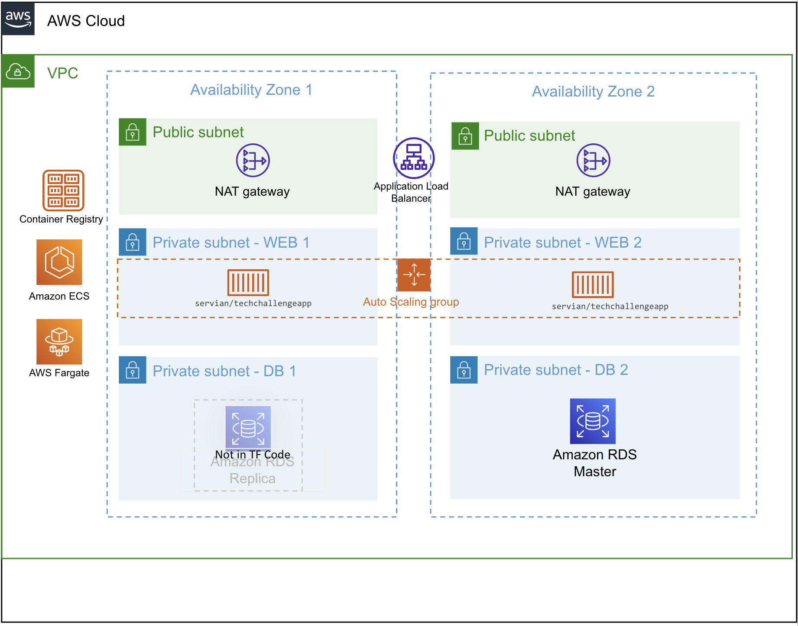

# Servian Assessment Response
This repo contains the terraform code to deploy the servian techchallange application to an AWS account.
Architecture of the infrastructure being deployed is indicated in the below diagram.

## Prerequisites

1. Terraform installed on your local device
2. AWS CLI
3. AWS CLI profile with the credentials of the target AWS account (by default it is set to use "servian-test-account", But you can override this in prod.tfvars file)

## Execute Terrafrom

`terraform apply -var-file="prod.tfvars"`

Once the infrastructure is deployed output will indicate the DNS name (FQDN) you need to connect to

*load_balancer_FQDN = "**xxxx.xxx.elb.amazonaws.com**"*

You can simply paste this value on your browser and access the site.

# Coninous Intigration and Deployment

Two aspects need to be considered for CI/CD in the context of this application
1. Infra realted CI/CD - i.e. any changes in the application architecture/ terraform code
2. Application related CI/CD - Any application code related being pushed to the production or staging environment

## Infra related CI/CD

You can store your repo in some SCM like github and configure a CI/CD tool like jenkins to either periodically poll the repo or have a webhook integration to trigger the pipleline when ever there is a change in the code. We can use a jenkins file to define the pipeline stages and actions to be executed in each stage.

In this case the stages will be to pull the latest artifact from he repo execute the terrafrom apply command with the tfvars applicable for the environment.
Prereqisutes will be terraform, AWS CLI and secure injection of the account credentials to the jenknins master or slave node running the pipeline.
A terraform remote backend will also be required if the jenkins setup has mutiple slave nodes or dynamic agents (distributed build environment)

To ensure no impact happens to production application infra due to code errors, we can create two piplelines (prod and dev) integrated to master and dev branches.
With code updates to master branch would require a merge request to be approved, with same code pushed to dev to verify the application infrastructure is being setup properly with the new code change.

## Application related CI/CD

Simillar to above we can integrate to application source code repo and use jenkinsfile and Dockerfile to define the pipeline and the container build instruction to build the image and update the container image run update-service in ECS.
Some old testing I have done with jenkinsfile and dockerfile can be found here - https://github.com/buddhikasj/webgoat
It basically tries to integrate an IAST + RASP tool "Contrast Security" with OWASP webgoat package while scanning the conainer image with Aqua container security tool.

Another option would be to use AWS CodePipeline and use buildspc.yaml file to define the stages for AWS CodeBuild to compile the code and configure deploy stage of the codepipeline to push the updated task definition to ECS.